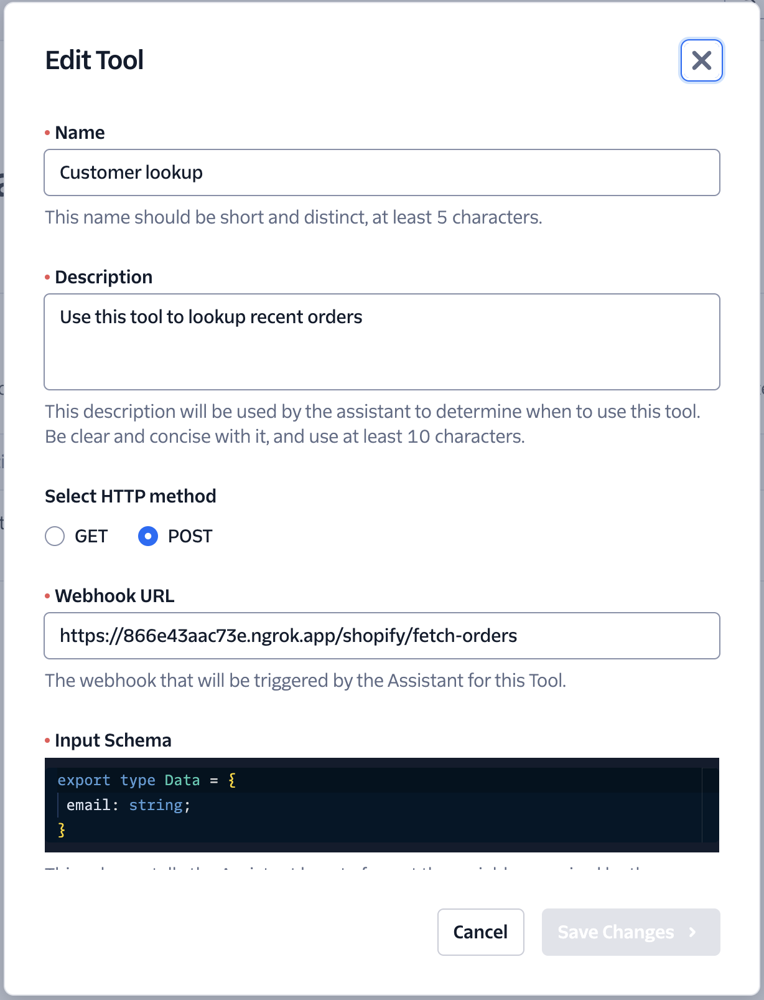

# Twilio CMS Integration Examples

Sample integration functions that run on Twilio Serverless that can be used by Flex, Bots and Studio to collect and update data from content management systems. For example adding tools for bots to pull recent orders
### Additional reading
See Magento API from Adobe here https://github.com/Genaker/nodejento

## Shopify

| Function                | Purpose                              |
| ----------------------- | ------------------------------------ |
| /shopify/fetch-orders   | Fetch orders from Shopify            |
| /shopify/fetch-products | Fetch products using the Shopify API |
| /shopify/update-order   | Fetch products using the Shopify API |

##  Adobe Commerce (Magento)
| Function                       | Purpose                               |
| ------------------------------ | ------------------------------------- |
| /magento/fetch-products-by-sku | Fetch products from Magento using SKU |

## Calling Functions using AI Assistants

To use these as tools for Twilio AI Assistants, simply point the URL to the deployed serverless function and configure the data to be passed, see example below.

